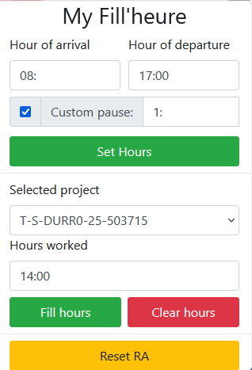

# MyFill'heure

Firefox extension to automatically fill the Activity report on Myfire

Set the working hours, then click on "Set Hours"

Then select a project and click "Fill hours"
Clear a project's hours by clicking "Clear hours"

Reset the whole RA to default with Reset RA
